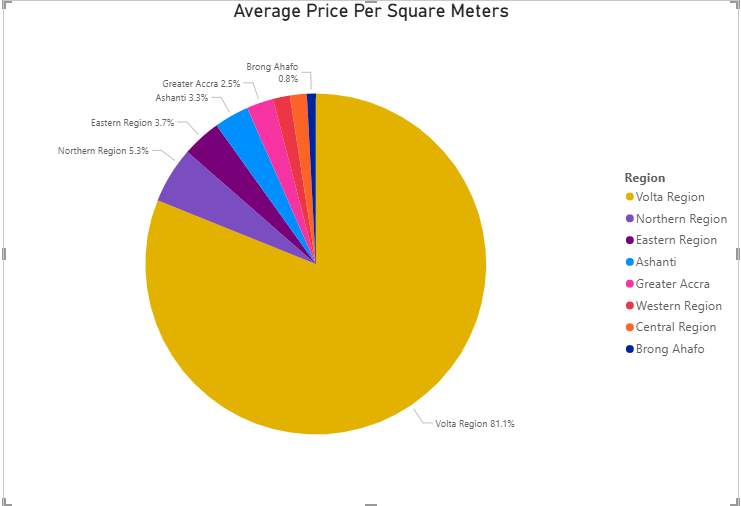

# Real-Estate-Market-Analysis
To perform EDA analysis on data collected about Ghana's rental space

# MARKET INSIGHTS

## 1. Which locations (region/localities) have the highest rental yields (price per square meter)?
The total average price per square meter is **14.38**. 
The locations in terms of regions with the highest rental yields are as follows;
| Regions       | Average price per SQM (GHS) |
|----------------|---------------------|
| Volta        | 457.14              |
| Northern        | 30.07                | 
| Eastern       | 20.79                | 
| Ashanti       | 18.61               |
| Greater Accra       | 14.33                |
| Western       | 9.06                |
| Central       | 9.02                |
| Brong Ahafo       | 4.70                |

 

*PICTORIAL REPRESENTATION OF THE TABLE*

## 2. What is the price distribution by locality - and where are the most affordable vs. luxury hotspots?
The price distribution by locality shows that there are more luxury hotspots are in these five (5) localities and they are all located in Greater Accra;
- East Legon
- Spintex
- Airport Residential
- Accra Metropolitan
- Cantonments

*PICTORIAL REPRESENTATION OF THE TABLE*

## 3. Are furnished properties rented at a significant premium compared to unfurnished?
Comparing the average price of furnished properties to unfurnished properties, you will discover that *furnished apartment attract 58.1%* of the market as compared to an *unfurnished apartment of 17.88%*

*PICTORIAL REPRESENTATION OF THE TABLE*

## 4. Which property type (flats, detached, etc.) dominates each region in terms of availability?
From the visual, it is clear that the property type that dominates the market is the flats followed by detached units.
| Region       | Flat | Detached Units | 
|----------------|---------------------|------------------|
| Greater Accra          | 10,619             | 4,638              |
| Ashanti Region         | 500                | 159              | 
| Central        | 144                | 45              | 
| Northern        | 147                | 47              | 

*PICTORIAL REPRESENTATION OF THE TABLE*

# PRICING AND INVESTMENT STRATEGY
## 5. Identify the top 5 high-demand localities (lots of listings, high prices)
Created a measure to count the total listings and for average price
``
TotalListings = COUNTTROWS(HouseRentals)
``
``
AveragePrice = AVERAGE(HouseRentals(Price))
``
Using a scattered chart, Total Listings for X-axis, and Average Price for Y-axis.

*PICTORIAL REPRESENTATION OF THE TABLE*
The top 5 high-demand localities include;
| Locality       | Number of Listings| Average Price | 
|----------------|---------------------|------------------|
| East Legon          | 2,565            | $14,000 | 
| Spintex      | 1,800                | $6,698 |
| Teshie        | 1,334                | $5,420
| Adenta        | 1,253                | $3,061
| Accra Metropolitan        | 1,035    | $9,181

## 6. Localities that are undervalued (large floor area but relatively low price)
Created a measure to determine the *Average Price Per Square Meter* and *Average Floor Area*
From the visual, it was discovered that **Volta Region** followed by **Nortern Region** have *larger floor area but offered relatively low price*

*PICTORIAL REPRESENTATION OF THE TABLE*

## 7. Properties with parking space
On a broader scale, parking spaces didn't have direct impact on prices. It is only few areas that had direct relationsip with prices and they are predominantly located in 
Accra. Those areas are Cantonments, Burma Camp, etc.

*PICTORIAL REPRESENTATION OF THE TABLE*

## 8. Maximize return per square meter
Using the average square meters, we realized that for an investor to yield maximum returns in terms of per square meter, it is advisable to target Volta Region as they offer a huge square area at an affordable price

# TENANTS AND OWNER INSIGHTS
## 5. Identify the top 5 high-demand localities (lots of listings, high prices)
